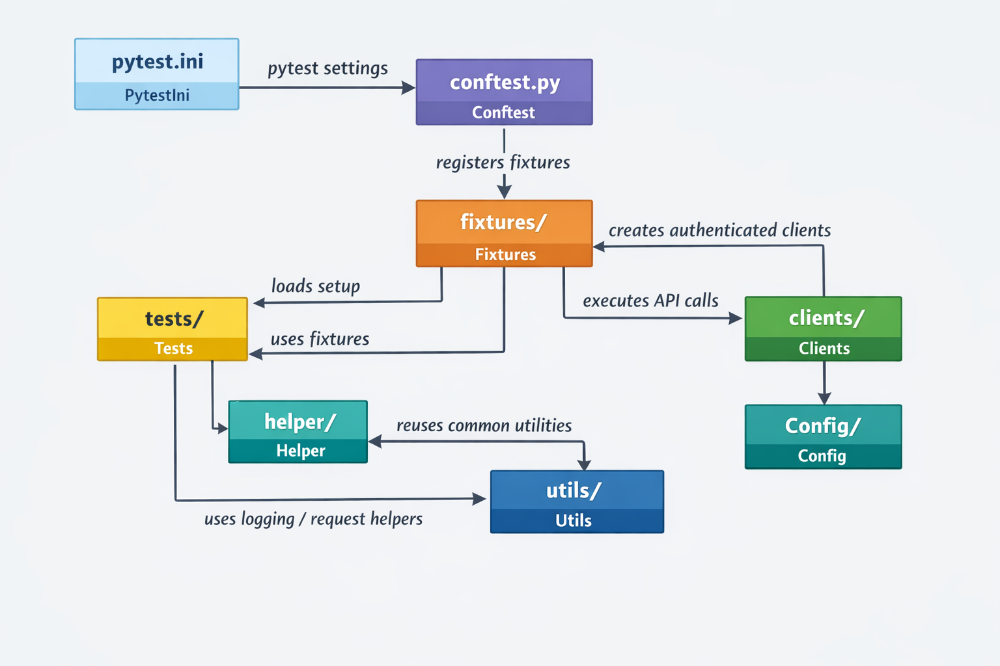

📄 README.md
# Claro Flex Integration Tests

This project contains automated integration tests for the Claro Flex platform APIs. It ensures API quality through status code validation, schema validation, and real-world flow testing with authentication.

## Prerequisites

- Python 3.9 or higher
- pip (Python package installer)
- Virtualenv (for creating isolated Python environments)

## Recommended VS Code Extensions

If you are using VS Code, the following extensions help maintain consistency and improve productivity in this project:

- `Python` (Microsoft) — provides IntelliSense, debugging, linting, and test discovery.
- `Pylance` (Microsoft) — enhances Python language support with fast type checking and code navigation.
- `Pytest` (Little Fox Team) — enables running and debugging pytest tests directly from VS Code.
- `JSON Tools` or `JSON Language Features` — helps with editing and validating `config/environments/*.json` files.
- `GitLens` — assists with repository history and code annotation, useful for collaborative review.

> Having these extensions installed makes it easier to run tests, edit configs, and understand code changes across the project.

## Project Setup

### 1. Clone the Repository

Clone this repository to your local machine.

### 2. Create a Virtual Environment

Create and activate a virtual environment to isolate dependencies:

```bash
python3 -m venv venv
source venv/bin/activate  # On macOS/Linux
# On Windows: venv\Scripts\activate
```

### 3. Install Dependencies

Install the required Python packages:

```bash
pip install -r requirements.txt
```

### 4. Configure Environment

Copy the example environment file and update it with your credentials:

```bash
cp config/environments/env.example.json config/environments/env.local.json
```

Edit `config/environments/env.local.json` with the actual values for your local environment:

```json
{
  "base_url": "https://your-api-base-url.com",
  "auth_url": "https://your-auth-url.com",
  "client_id": "your-client-id",
  "username": "your-username",
  "password": "your-password"
}
```

The project supports multiple environments: `local`, `sit`, `sanity`. Set the environment using the `ENV` variable (defaults to `local`).

## Running Tests

### Basic Test Run

To run all integration tests:

```bash
pytest
```

### Run with Specific Environment

Set the environment variable and run:

```bash
export ENV=sit  # or 'sanity', 'local'
pytest
```

### Using the Run Script

The `run.sh` script sets the environment to `sit` and runs integration tests:

```bash
./run.sh
```

### Test Markers

- Use `-m integration` to run only integration tests.
- Use `-m building` for building-related tests.

Example:

```bash
pytest -m integration -v
```

### Verbose Output

Tests run with verbose output (`-v`) and logging enabled. Check the console for detailed logs.

## Project Structure

- `clients/`: API client classes for making HTTP requests (e.g., `auth_client.py`, `menu_client.py`).
- `config/`: Configuration files and environment settings.
  - `environments/`: JSON files for different environments.
  - `test_users.py`: Test user credentials for different scenarios.
- `fixtures/`: Pytest fixtures for authentication, data setup, and schemas.
- `helper/`: Helper functions for assertions and data extraction (e.g., `menu_helper.py`).
- `tests/`: Test case files (e.g., `test_menu.py`).
- `utils/`: Utility modules like logging, PKCE generator, and request helpers.
- `conftest.py`: Global pytest configuration and fixture registration.
- `pytest.ini`: Pytest settings.
- `requirements.txt`: Python dependencies.
- `run.sh`: Shell script for running tests in SIT environment.

## Architecture Overview

The diagram below shows how the main project components connect:


## Key Concepts

### Authentication

The tests use PKCE (Proof Key for Code Exchange) flow with PingFederate for dynamic token generation. Authentication is handled automatically via fixtures.

### Schema Validation

Responses are validated against JSON schemas using `jsonschema` to ensure contract compliance.

### Multi-User Testing

Different test users simulate various business scenarios (e.g., users with multiple products, no products, mobile-only).

### Logging

Logs are configured to show INFO level messages in the console for debugging.

## Contributing

1. Write tests in the `tests/` directory.
2. Use fixtures from `fixtures/` for setup.
3. Follow the existing structure and naming conventions.
4. Run tests locally before committing.

For questions, refer to the code comments or contact the team.